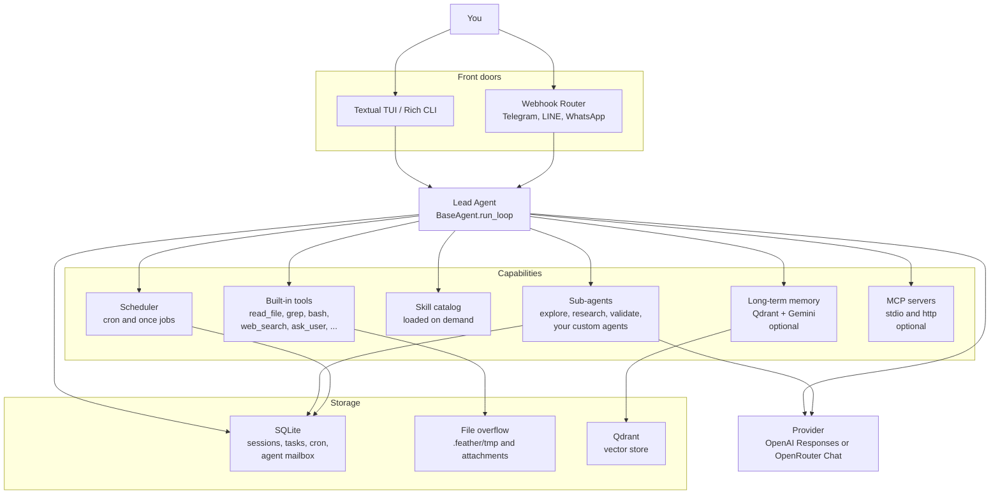

# Feather

Feather is a personal AI agent that lives in your terminal. You talk to it,
it talks back, and it can use tools (read your files, run shell commands,
search the web, remember things across sessions) to help you get work done.

The package is published on PyPI as **`feather-os`**. The command you type
is just `feather`.

## What it does

* Chat with a single "lead" agent through a colorful terminal UI (built
  on Textual) or a simpler streaming console.
* Use built-in tools for reading files, running bash, searching code with
  grep, fetching web pages, and more.
* Optionally turn on long-term memory so the agent remembers facts about
  you across sessions.
* Spawn helper sub-agents in the background for bigger jobs (research,
  validation, exploration).
* Add your own skills, custom sub-agents, and MCP servers without
  touching the package code.
* Reach the agent from Telegram, LINE, or WhatsApp.

## How it fits together



The full architecture, with sequence diagrams for the agent loop,
sub-agent dispatch, memory pipeline, skills, MCP, and compaction, is
in [docs/architecture.md](docs/architecture.md).

## 60-second quickstart

```bash
pip install feather-os                    # or: pipx install feather-os
                                          # or: uv tool install feather-os
feather init-memory                       # optional: start Qdrant so the
                                          # agent remembers things across
                                          # chats (needs Docker)
feather onboard                           # one-time setup, collects keys
feather                                   # opens the chat UI
```

Type a question. Press Enter to send. Type `/exit` when you are done.

If you do not have an OpenAI key yet, get one at
<https://platform.openai.com/api-keys>. If you ran `feather init-memory`,
you will also need a Gemini key from
<https://aistudio.google.com/apikey> for embeddings; the wizard will ask
for it. The full memory walkthrough is in
[docs/memory.md](docs/memory.md).

Skip `feather init-memory` if you do not have Docker. The agent still
works fine, it just starts every chat fresh.

## Where to go next

| You want to... | Read |
|---|---|
| Install Feather and run your first chat | [docs/getting-started.md](docs/getting-started.md) |
| See the architecture and how the agent loop works | [docs/architecture.md](docs/architecture.md) |
| Switch between OpenAI and OpenRouter, change the model | [docs/providers.md](docs/providers.md) |
| Turn on long-term memory | [docs/memory.md](docs/memory.md) |
| Add or write your own skills | [docs/skills.md](docs/skills.md) |
| Add a custom sub-agent | [docs/agents.md](docs/agents.md) |
| Connect an MCP server | [docs/mcp.md](docs/mcp.md) |
| See every built-in tool, slash command, and keyboard shortcut | [docs/tools-and-commands.md](docs/tools-and-commands.md) |
| Drop files into a chat (text, images, PDFs) | [docs/attachments.md](docs/attachments.md) |
| Schedule the agent to do something later | [docs/scheduling.md](docs/scheduling.md) |
| Talk to Feather from Telegram, LINE, or WhatsApp | [docs/messaging.md](docs/messaging.md) |
| Look up every config knob | [docs/configuration.md](docs/configuration.md) |
| Fix something that broke | [docs/troubleshooting.md](docs/troubleshooting.md) |

## Where Feather stores things

Two locations, on purpose. Personal stuff (API keys, your profile,
installed skills) lives in your home directory and follows you across
projects. Project stuff (chat history for one repo, attachments,
artifacts) lives next to your code.

| Path | What is in it |
|---|---|
| `~/.feather/` | global config, your `.env`, your `user.md`, installed skills, the memory marker, sessions when you run from a non-project folder |
| `./.feather/` | the project's chat database, tool output overflow, attachments, logs, project-only skills |

Run `feather init` inside any folder to pin a project to that folder.
Otherwise Feather walks up from where you are and uses the first
`.feather/` it finds; if it finds none, it falls back to the global
location.

The full layout and override env vars are documented in
[docs/configuration.md](docs/configuration.md#paths) and
[docs/getting-started.md](docs/getting-started.md#where-things-live).

## Develop locally

```bash
git clone https://github.com/timho102003/feather-os.git
cd feather-os
uv sync                                   # editable install plus dev deps
uv run feather --version
uv run pytest
```

The version is derived from git tags via `hatch-vcs`. `uv build` produces
the wheel and sdist under `dist/`.

## License

Apache License 2.0. See [LICENSE](LICENSE).

The full changelog is in [CHANGELOG.md](CHANGELOG.md).
