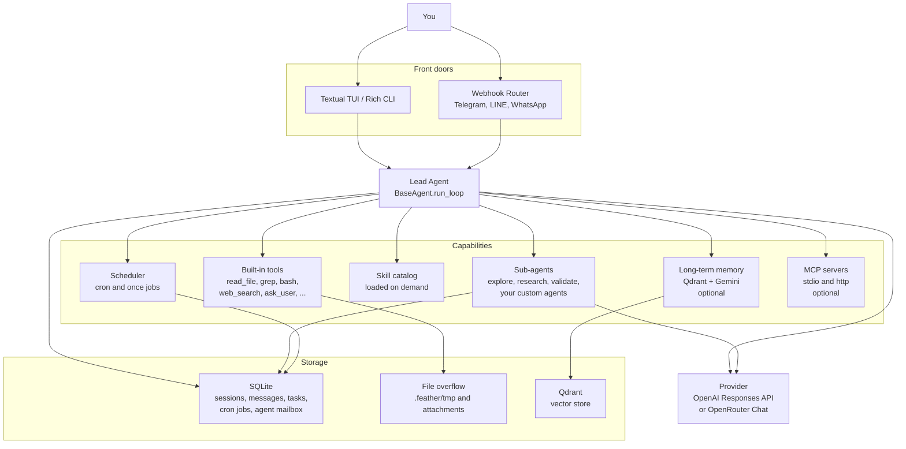
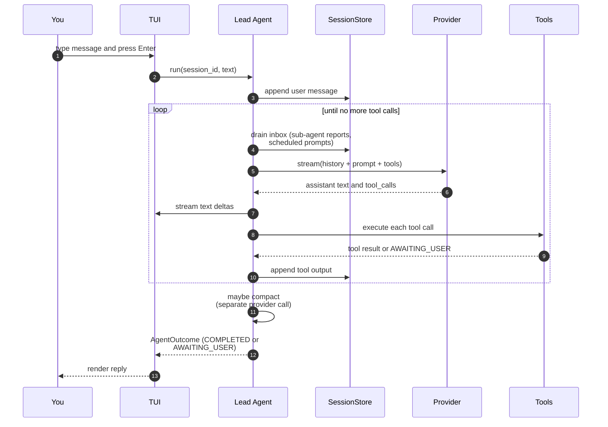
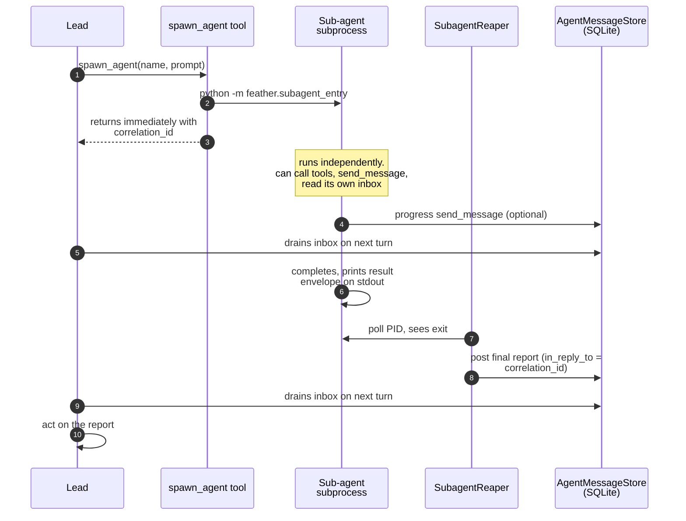
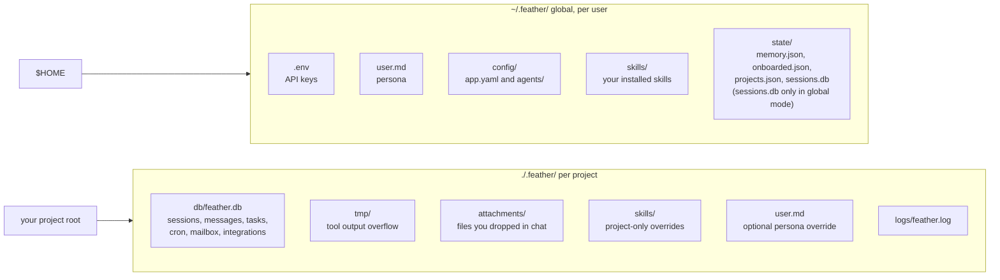
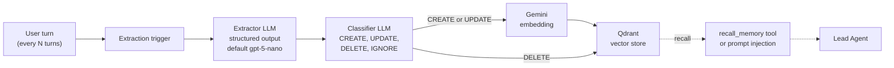
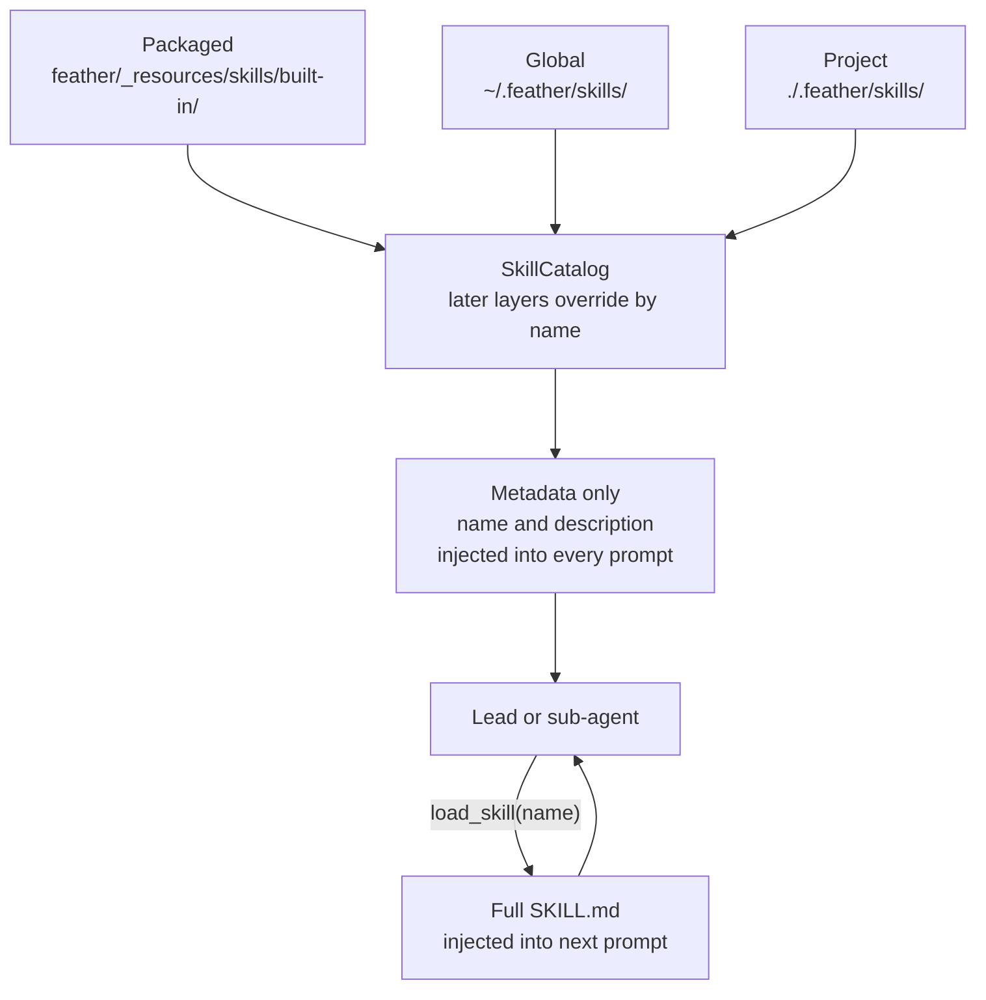
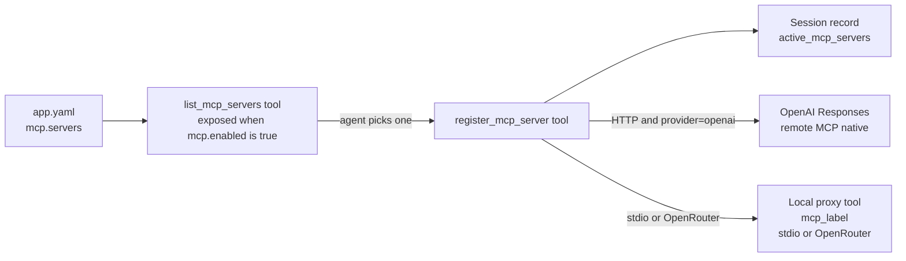
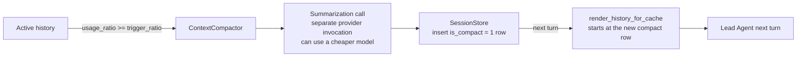
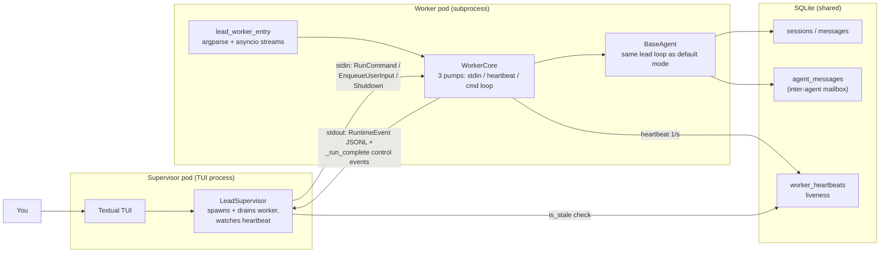

# Architecture

This page explains how Feather is wired together. Each section opens
with a diagram and a one-paragraph narrative, then drills into the
details that matter.

The diagrams are written in Mermaid. GitHub renders them inline. If
you are reading this on disk, paste the code blocks into
<https://mermaid.live> to view them.

## System overview

The big picture: one user, one lead agent, a handful of capabilities.
Everything the agent can do (tools, sub-agents, skills, memory, MCP)
plugs into the same agent loop. Storage is shared across the lead and
every sub-agent.

A few things worth calling out:

* The **lead** is just an instance of `BaseAgent`. Sub-agents are also
  instances of `BaseAgent`. The loop is the same; the differences are
  what tools each one has and which prompts it loads.
* **Skills** are not loaded eagerly. The agent sees only their names
  and descriptions in every prompt, and loads bodies on demand with
  `load_skill`. This is what keeps the prompt cheap.
* **Memory** is optional. Without it, the agent still works fine; it
  just starts every chat fresh.
* **MCP** is optional. Without it, the discovery tools are not even
  registered.

## Inside the agent loop

When you press Enter, this is what runs.

The loop is async and streams. Two specifics worth knowing:

* **The inbox drain happens at the top of every turn.** That is how
  sub-agent final reports and scheduled prompts get into the
  conversation without interrupting whatever the lead is in the
  middle of.
* **Compaction runs in a separate provider call.** When the chat fills
  about 80% of the context window, Feather summarizes the older
  messages with its own model call (which can be a different,
  cheaper model) and continues from the summary. The active model
  never burns its own context summarizing itself.

If a tool returns `AWAITING_USER` (only the `ask_user` tool does this
today), the loop pauses, your terminal prompts you for an answer, and
the loop resumes with that answer as the next user message.

## Spawning a sub-agent

Sub-agents run as separate Python subprocesses. The lead never blocks
on them.

Why subprocesses and not threads? Two reasons:

* **Isolation.** A sub-agent that goes off the rails (infinite loop,
  memory leak, segfault inside a native dependency) does not take the
  lead with it.
* **Parallelism without GIL pain.** Many sub-agents can stream from
  different providers concurrently without fighting the same Python
  process.

The mailbox is a SQLite table. That choice is on purpose: it survives
restarts. If the lead is killed mid-conversation, restarting it
re-drains the same inbox and continues.

## Where state lives

Two roots, on purpose. Personal stuff follows you across projects;
project stuff sticks with the code.

`feather` walks up from your current directory looking for an existing
`.feather/`. If it finds one, it runs in **project mode** and reads
and writes the project tree. If it finds none, it falls back to
**global mode** and uses `~/.feather/state/sessions.db` for chat
history. Run `feather init` inside a project to pin one.

The full layout is in
[getting-started.md](getting-started.md#where-things-live) and the
override env vars are in
[configuration.md](configuration.md#paths).

## Long-term memory

Memory is a background pipeline. It sits next to the conversation
loop, never inside it.

A few design choices to know about:

* **Extraction and classification are separate LLM calls** so each can
  use the cheapest model that handles structured output well. The
  shipped defaults pin both to OpenAI nano regardless of which model
  the conversation uses. See [providers.md](providers.md#per-agent-and-per-task-overrides).
* **The trigger fires every N user turns**, not on every tool call.
  Defaults to 10. Raise it to extract less often, lower it to keep
  memory fresher.
* **Recall has two paths.** Top-k results land in the prompt
  automatically every turn. The agent can also call `recall_memory`
  explicitly when it needs a specific fact.

The whole pipeline is a no-op if the marker file at
`~/.feather/state/memory.json` is absent. See
[memory.md](memory.md) for the user-facing setup.

## Skill discovery and loading

Three layers, latest layer wins. The agent sees only metadata until it
asks for a body.

Why three layers? The packaged set is what ships with the wheel and
should not be edited. The global layer is your personal customization
that follows you everywhere. The project layer is for things that only
matter inside one repo.

Why metadata-only by default? Skill bodies can be hundreds of lines
each. Loading every one in every prompt would burn context tokens for
information the agent does not need. Progressive disclosure keeps
prompts cheap.

## MCP activation

MCP servers are configured in `app.yaml` but never connected at
startup. The agent connects them on demand.

The pattern matters because some MCP servers are slow to start
(Playwright launches a browser; database servers open connections).
Cold-starting them only when the session needs them keeps the chat
responsive.

A resumed session reads `active_mcp_servers` from the session record
and reconnects the same servers, so MCP state survives restarts.

## Compaction

When the prompt is about to overflow the model's context window,
Feather rolls history into a summary using a separate provider call.

Two design choices to understand:

* **The summarization provider is separate from the active provider.**
  The current chat model never spends its own context summarizing
  itself. The default summary call uses a small, cheap model.
* **The summary is stored as a regular message row** with a
  `is_compact = 1` flag. Future history reads start from the latest
  compact row, so the chat keeps moving forward without the agent
  needing to know the older messages ever existed.

Default trigger is 80% of the context window. The active model and
window size are configured in
[configuration.md](configuration.md#compaction).

## Self-repair safety net (opt-in)

By default the lead agent runs as an `asyncio.Task` on the same event
loop as the Textual TUI. Opting in to the safety net (either via the
onboarding wizard, by setting `self_repair.enabled: true` in
`app.yaml`, or with `FEATHER_USE_LEAD_WORKER=1` in the environment)
flips a two-pod layout:

* The TUI process becomes the **supervisor**. It pre-creates the lead
  session, spawns the worker subprocess, drains its stdout into the
  same `_handle_runtime_event` callback that the in-process path uses,
  and watches a new `worker_heartbeats` SQLite row for staleness.
* The lead becomes the **worker** (`python -m feather.lead_worker_entry`).
  It builds its own `FeatherRuntime`, runs the same `BaseAgent` loop,
  emits one JSON line per `RuntimeEvent` to stdout, and writes a
  heartbeat once per second.

Wire shapes:

* **Supervisor → worker** (`feather.core.worker_command_codec`) carries
  four typed commands: `RunCommand`, `ResumeOnInboxCommand`,
  `EnqueueUserInputCommand`, `ShutdownCommand`.
* **Worker → supervisor** (`feather.core.runtime_event_codec`) carries
  every `RuntimeEvent` the in-process path emits, plus three control
  events (`_run_complete`, `_run_failed`, `_shutdown_ack`) that the
  supervisor consumes internally and never forwards to the UI.
* **Heartbeat** (`feather.storage.worker_heartbeat_store`) is one row
  keyed by `session_id`. Worker writes; supervisor reads.

When the env flag is on, the supervisor process spawns three
auxiliary tasks alongside the worker:

* **Hang watcher** polls `LeadSupervisor.is_stale()` every 2 s and
  surfaces a red `Lead unresponsive` marker (and a green `Lead
  recovered` marker) on transitions. State machine is two-state, so
  a sustained hang produces one alert, not one per tick.
* **Log triage bot** tails `.feather/logs/feather.log` for ERROR-level
  entries since its last reported high-water mark and posts a single
  summary message into the lead's mailbox via `agent_messages`.
  Auto-resets dedup on log rotation (inode change).
* **Restart watcher** polls the new `sessions.restart_requested_at`
  column once per ~1.5 s. When the lead's `request_restart` tool sets
  the flag, the watcher cancels any in-flight run (with a 10 s cap so
  a stuck cleanup can't block the watchdog), calls
  `LeadSupervisor.restart()` (serialized via `_restart_lock` so it
  can't race a concurrent `/restart-lead` slash), then drops a
  "restart succeeded / failed" message back into the inbox.

Two new tools surface to the lead in worker mode:

* **`request_restart(reason)`** — self-repair primitive. The lead
  calls this after patching `feather/*` modules and verifying the
  change with tests. The tool itself does not kill anything; it
  writes the flag and returns. Response carries an install-mode
  warning (editable / wheel / read-only) so the model can advise the
  user about upgrade durability.
* **`submit_github_report(kind, title, body, repo?)`** — wraps
  `gh issue create` via subprocess. Reads the `submit-github-report`
  skill before invocation; never auto-submits; rejects PR kind for v1
  with a clear "not yet" notice.

Plus a new slash command:

* **`/restart-lead`** — manual recovery hook. Same `LeadSupervisor.restart()`
  the watcher calls; the slash command is the user-driven alternative
  for the case where the lead can't (or won't) call `request_restart`
  itself, e.g. after a hang banner.

Default users see byte-identical behavior because the env flag is off
and the new tools / commands are no-ops without the supervisor.

Limitations enforced by the runtime when worker mode is on:

* Cron scheduler is not started — would race the worker on session
  state.
* Messaging adapters (Telegram / LINE / WhatsApp) are not started for
  the same reason.

See [configuration.md → Self-repair safety net](configuration.md#self-repair-safety-net-opt-in)
for the env var, the YAML setting, and the limitations, and
[tools-and-commands.md](tools-and-commands.md#self-repair-and-upstream-reporting)
for the per-tool reference.

## Putting it all together

If you read all six diagrams, you have the whole mental model:

1. The **lead agent loop** drives every conversation, drains its inbox,
   calls tools, streams responses, and compacts when needed.
2. **Sub-agents** are full agents in their own subprocess that talk
   back to the lead through a SQLite mailbox.
3. **State** lives in two roots so personal config follows you and
   project history stays with the code.
4. **Memory** is a background pipeline that lives next to the chat,
   not inside it.
5. **Skills** stay out of the prompt until they are needed.
6. **MCP** servers connect on demand and survive session restarts.
7. **Compaction** keeps long sessions alive without burning the active
   model's context.
8. **Self-repair safety net** (opt-in) splits the lead into its own
   subprocess so the supervisor can detect hangs, surface a recovery
   action, and let the agent reload its own patched code without
   losing the conversation.

Each piece is documented in its own guide. Use this page when you need
to see how they fit.
